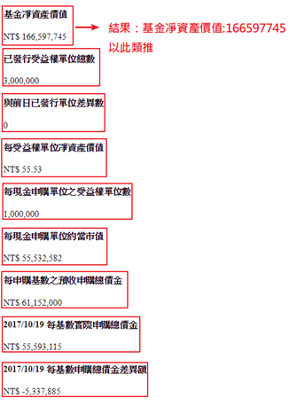

# regular_expressions_practice
Learn how to use regular_expressions
# 題目
- Q1：比對出正確的身分證字號
- Q2:輸入密碼必須是8個字元以上，不得為+-*/.!@#$%^&*()等特殊字元
- Q3:員工的email帳號，要取英文的姓名
- Q4:[Q4.htm](Q4.htm) 

    
- Q5: [Q5.htm](Q5.htm)

    用正規表示式解成DataTable，要有欄位名稱
- Q6: [Q6.htm](Q6.htm)
    https://www.twse.com.tw/zh/page/trading/exchange/MI_INDEX.html

    取得所有分類

